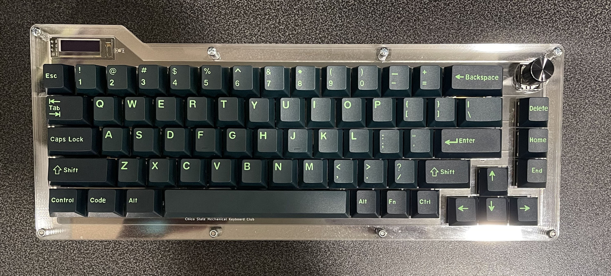

<h1 align = "center"> CMKC 65% Keyboard</h1>

    

    A 65% keyboard that features a rotary encoder, OLED Screen and Programmable Firmware.

<h2 align = "center">
    <a src = "Docs/">Installation Guide</a>
</h2>

<h2 align = "center">
    <a src = "Docs/">Parts</a>
</h2>

<h2 align = "center">Credits</h2>

    
 Circuit-Dude 

    
 Thomas Devine 

</ul>
<h2 align = "center'>
    <a src = "Docs/Sources">Sources</a>
</h2>
